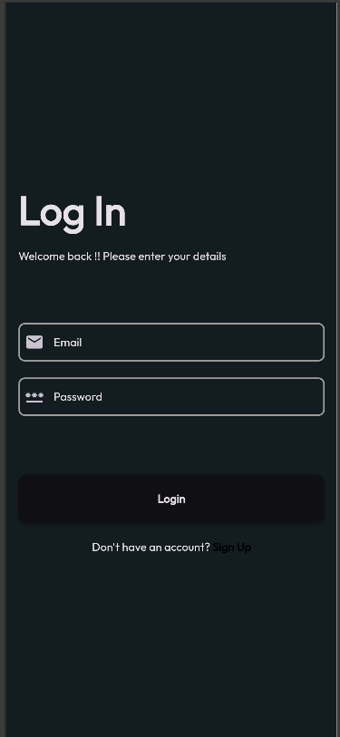
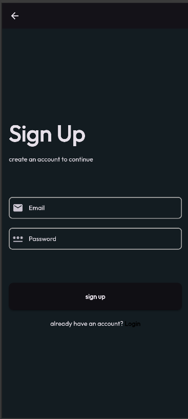
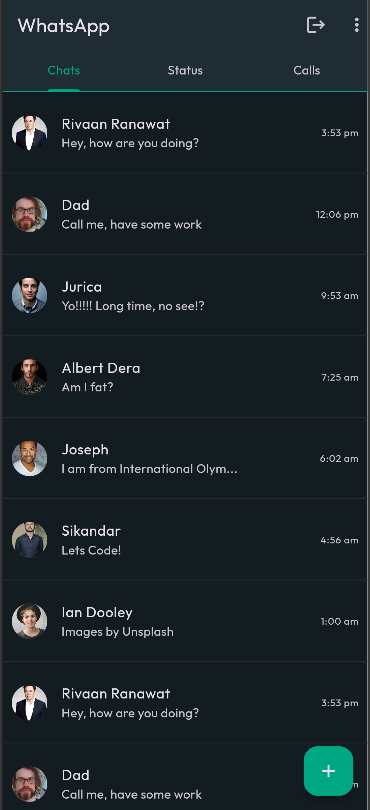
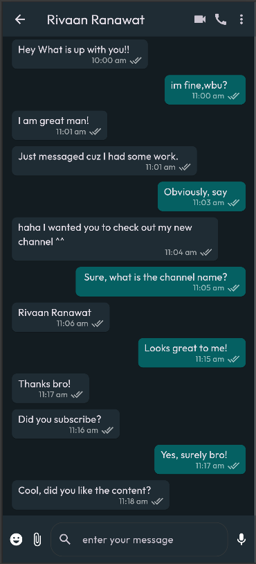
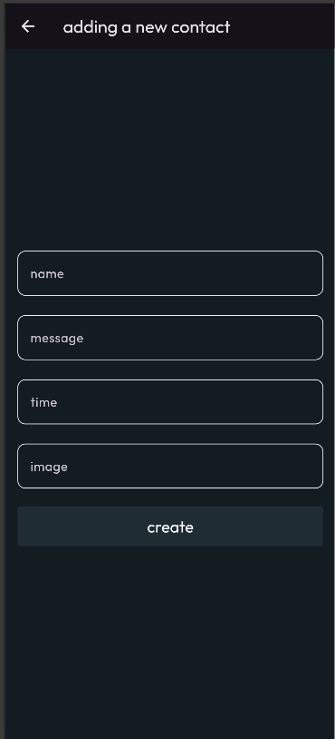
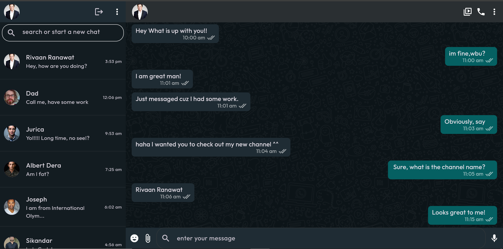
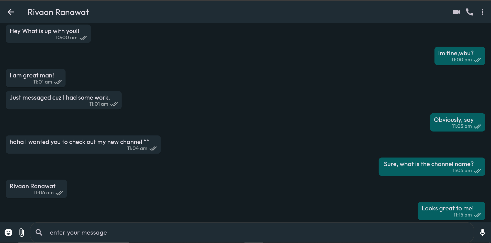
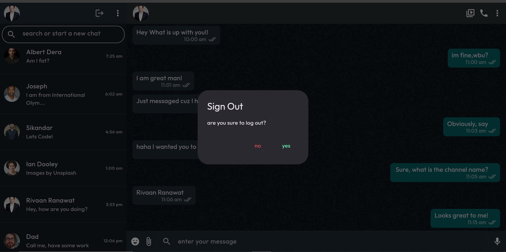

# 💬 WhatsApp Clone - Flutter

<div align="center">


**A WhatsApp clone built with Flutter, featuring Firebase authentication, and responsive design for mobile and web platforms.**

[Features](#-features) • [Screenshots](#-screenshots) • [Installation](#-installation) • [Tech Stack](#-tech-stack) • [Project Structure](#-project-structure) • [Contributing](#-contributing)

</div>

---

## 📋 Table of Contents

- [Overview](#-overview)
- [Features](#-features)
- [Screenshots](#-screenshots)
- [Tech Stack](#-tech-stack)
- [Architecture](#-architecture)
- [Installation](#-installation)
- [Firebase Setup](#-firebase-setup)
- [Project Structure](#-project-structure)
- [Key Components](#-key-components)
- [Responsive Design](#-responsive-design)
- [Contributing](#-contributing)
- [License](#-license)
- [Contact](#-contact)

---

## 🌟 Overview

This WhatsApp Clone replicates the core features of WhatsApp. Built with **Flutter** and powered by **Firebase**, it demonstrates best practices in mobile and web development, including responsive design, state management, and real-time data synchronization.

### Why This Project?

- **Cross-Platform:** Single codebase for Android, iOS, Web, Windows, macOS, and Linux
- **Responsive:** Adaptive UI that works seamlessly on mobile and desktop
- **Modern UI:** WhatsApp-inspired dark theme with custom colors
- **Scalable:** Clean architecture with modular components

---

## ✨ Features

### 🔐 Authentication
- **Firebase Authentication** with email/password
- Secure login and signup system
- Persistent user sessions
- Logout functionality with confirmation dialog

### 💬 Messaging
- Real-time chat interface
- Message bubbles (sender & receiver cards)
- Timestamp display with message status
- Read receipts (double check marks)
- Responsive message input field


### 👥 Contacts
- Contact list with profile pictures
- Recent messages preview
- Add new contacts functionality
- Avatar display with network images

### 📱 Mobile Features
- Tab navigation (Chats, Status, Calls)
- Floating action button for quick actions
- Individual chat screens
- AppBar with actions (video call, voice call, more options)
- Back navigation between screens
- Material Design components

### 💻 Web Features
- Split-screen layout (contacts sidebar + chat area)
- Profile bar with user information
- Search bar for finding conversations
- Desktop-optimized UI
- Responsive chat area (75% width)
- Custom background image support

### 🎨 UI/UX
- **Dark theme** throughout the app
- Custom color scheme matching WhatsApp
- **Outfit font** for modern typography
- Consistent spacing and padding
- Material 3 design system
- Responsive constraints for different screen sizes

---

## 📸 Screenshots

### 🔐 Authentication



### 🏠 Home Screen


### 💬 Messaging


### 👥 Contacts


### 💻 Web Interface



### ⚙️ Other Features


---

## 🛠️ Tech Stack

### Frontend
- **Flutter 3.9.2** - UI Framework
- **Dart** - Programming Language
- **Material 3** - Design System

### Backend & Services
- **Firebase Core** - Backend infrastructure
- **Firebase Authentication** - User authentication
- **Cloud Firestore** - Real-time database

### State Management
- **StreamBuilder** - Real-time data updates
- **StatelessWidget** - UI components

### Assets & Fonts
- **Custom Outfit Font** - Typography
- **Network Images** - Profile pictures
- **Custom Background** - Chat interface

---

## 🏗️ Architecture

This project follows a **clean architecture** approach with clear separation of concerns:

```
whatsapp_clone/
│
├── lib/
│   ├── main.dart                    # App entry point
│   │
│   ├── screens/                     # Main screen layouts
│   │   ├── login_screen.dart        # User login
│   │   ├── signup_screen.dart       # User registration
│   │   ├── mobilescreen.dart        # Mobile layout
│   │   ├── webscreen.dart           # Web layout
│   │   └── signout_screen.dart      # Logout handling
│   │
│   ├── helper_widgets/              # Reusable components
│   │   ├── layouts.dart             # Responsive layout manager
│   │   ├── contactlist.dart         # Contact list view
│   │   ├── chatlist.dart            # Chat messages list
│   │   ├── sendercard.dart          # Sent message bubble
│   │   ├── recievercard.dart        # Received message bubble
│   │   ├── mobile_chat_screen.dart  # Individual chat screen
│   │   ├── add_new_contact.dart     # Add contact dialog
│   │   ├── userinfo.dart            # User information widget
│   │   ├── web_profile_bar.dart     # Web profile header
│   │   ├── web_searchbar.dart       # Web search component
│   │   └── web_chat_appbar.dart     # Web chat header
│   │
│   └── utils/                       # Utilities & constants
│       ├── colors.dart              # Color theme definitions
│       └── info.dart                # Sample data
│
├── assets/
│   ├── images/                      # Image assets
│   │   └── backgroundImage.png
│   └── fonts/                       # Custom fonts
│       └── Outfit-Regular.ttf
│
└── firebase_options.dart            # Firebase configuration
```

## 📦 Installation

### Prerequisites

Before you begin, ensure you have installed:

- [Flutter SDK](https://flutter.dev/docs/get-started/install) (3.9.2 or higher)
- [Dart SDK](https://dart.dev/get-dart) (comes with Flutter)
- [Android Studio](https://developer.android.com/studio) / [VS Code](https://code.visualstudio.com/)
- [Git](https://git-scm.com/downloads)
- A Firebase account (free)

### Step 1: Clone the Repository

```bash
git clone https://github.com/ShomailKhan/whatsapp_clone.git
cd whatsapp_clone
```

### Step 2: Install Dependencies

```bash
flutter pub get
```

### Step 3: Configure Firebase

1. Go to [Firebase Console](https://console.firebase.google.com/)
2. Create a new project
3. Enable **Authentication** (Email/Password)
4. Enable **Cloud Firestore**
5. Add your apps (Android/iOS/Web)
6. Download configuration files:
   - Android: `google-services.json` → `android/app/`
   - iOS: `GoogleService-Info.plist` → `ios/Runner/`
   - Web: Update `firebase_options.dart`

### Step 4: Run the App

#### For Mobile (Android/iOS)
```bash
flutter run
```

#### For Web
```bash
flutter run -d chrome
```

#### For Windows
```bash
flutter run -d windows
```

#### For macOS
```bash
flutter run -d macos
```

#### For Linux
```bash
flutter run -d linux
```

---

## 📂 Project Structure

### Key Directories

```
whatsapp_clone/
│
├── android/              # Android native code
├── ios/                  # iOS native code
├── web/                  # Web-specific files
├── windows/              # Windows native code
├── macos/                # macOS native code
├── linux/                # Linux native code
│
├── lib/                  # Main application code
│   ├── main.dart         # Entry point
│   ├── screens/          # Screen layouts
│   ├── helper_widgets/   # Reusable widgets
│   └── utils/            # Constants & utilities
│
├── assets/               # Static assets
│   ├── images/           # Image files
│   └── fonts/            # Font files
│
├── test/                 # Unit & widget tests
│
├── pubspec.yaml          # Dependencies
├── analysis_options.yaml # Lint rules
└── README.md             # This file
```

---

## 🚀 Features Breakdown

### ✅ Implemented Features

- [x] Firebase Authentication (Email/Password)
- [x] Responsive mobile layout
- [x] Responsive web layout
- [x] Contact list view
- [x] Individual chat screens
- [x] Message bubbles (sender/receiver)
- [x] Timestamps and read receipts
- [x] Add new contacts
- [x] Tab navigation
- [x] Logout functionality
- [x] Custom theme and fonts
- [x] Network image loading
- [x] AppBar with actions
- [x] Floating action button

### 🔮 Future Enhancements

- [ ] Real-time message sending/receiving
- [ ] Image/video sharing
- [ ] Voice messages
- [ ] Video calls
- [ ] Voice calls
- [ ] Status/Stories feature
- [ ] Group chats
- [ ] Message notifications
- [ ] Online/offline status
- [ ] Last seen timestamp
- [ ] Message search
- [ ] Dark/light theme toggle
- [ ] Profile customization
- [ ] Settings page
- [ ] End-to-end encryption

---

## 🧪 Testing

### Run Tests

```bash
# Run all tests
flutter test

# Run with coverage
flutter test --coverage

# Run specific test file
flutter test test/widget_test.dart
```

### Test Types

- **Unit Tests:** Logic and utility functions
- **Widget Tests:** UI components
- **Integration Tests:** End-to-end flows

---

## 🤝 Contributing

Contributions are welcome! 

## 👨‍💻 Contact

**Shomail Khan**

- GitHub: [@ShomailKhan](https://github.com/ShomailKhan)
- Project Link: [https://github.com/ShomailKhan/whatsapp_clone](https://github.com/ShomailKhan/whatsapp_clone)

---

## 🙏 Acknowledgments

- [Flutter Team](https://flutter.dev/) for the amazing framework
- [Firebase](https://firebase.google.com/) for backend services
- [WhatsApp](https://www.whatsapp.com/) for design inspiration
- [Material Design](https://material.io/) for UI guidelines

---

## 📊 Project Stats


---

<div align="center">

### ⭐ Star this repository if you found it helpful!

**Made with ❤️ and Flutter**

[Back to Top](#-whatsapp-clone---flutter)

</div>
